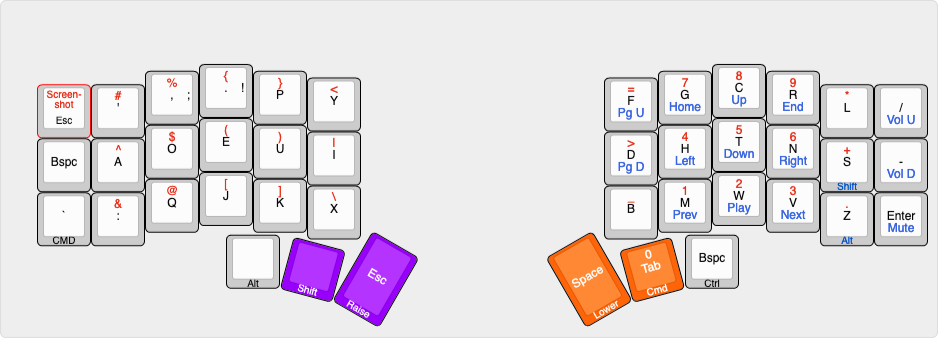

# crkbd/caseyWebb

> A fairly minimal layout for the crkbd/corne keyboard

Legend:

-   Black: Base (Dvorak); characters to the right indicate non-standard shift states (e.g. `,` -> `;`)
-   Red: Raise (Symbols)
-   Blue: Lower (Nav)

Combos:

-   Purple: Meh (Alt + Shift + Ctrl). Add CMD with right hand for full Hyper.
-   Orange: Spotlight (CMD + Space). Allows chording without sequence issues (i.e. triggerering Lower + Tab)
